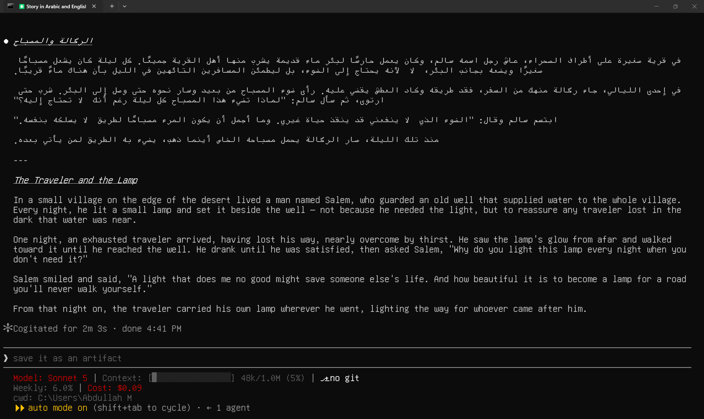
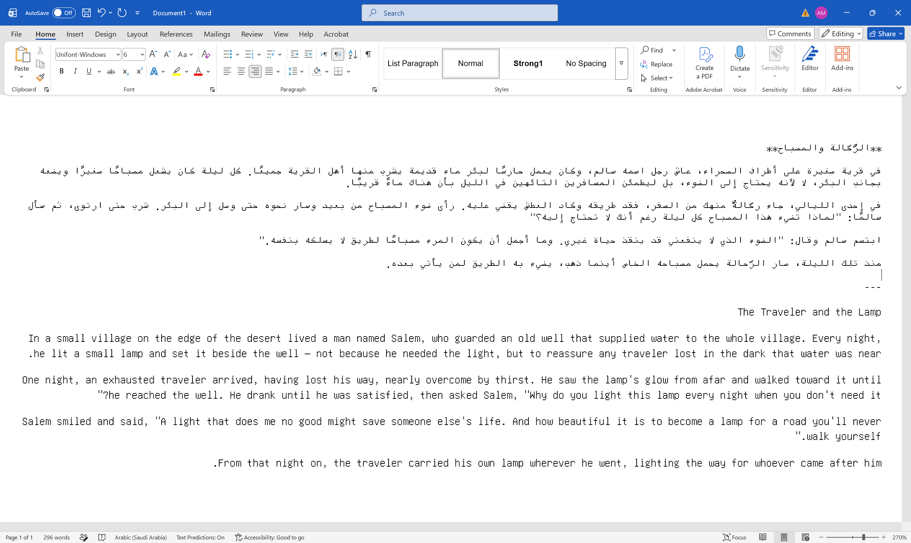
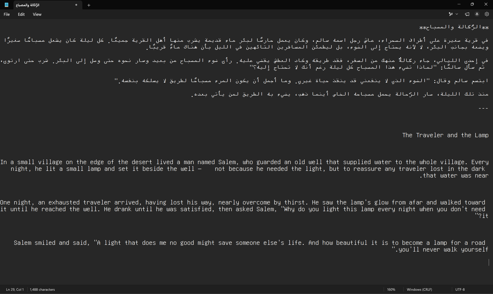
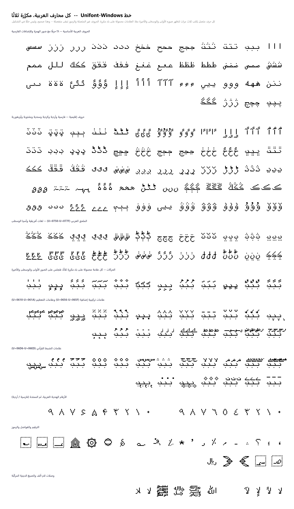
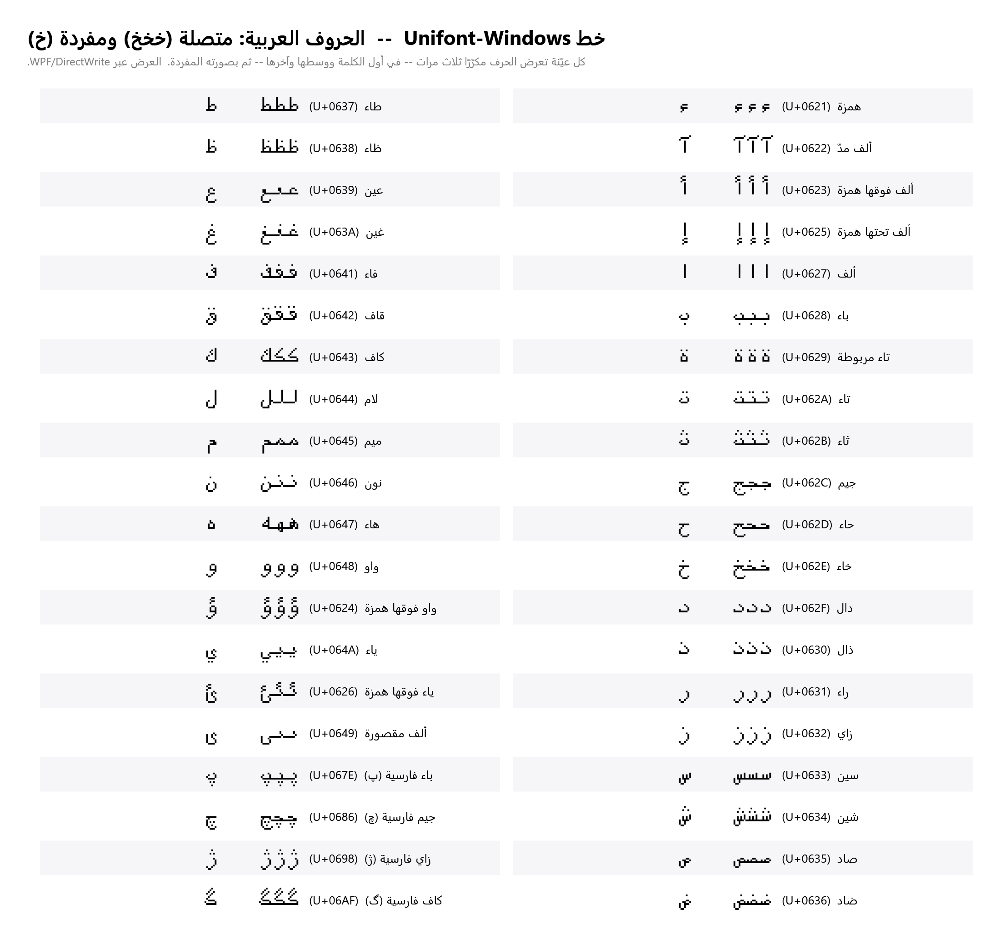
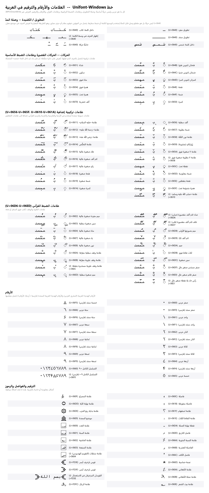
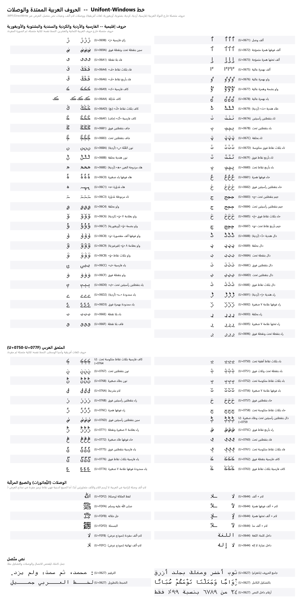

# Unifont-Windows

<div dir="rtl">

نسخة معاد بناؤها لويندوز من خط [GNU Unifont](https://unifoundry.com/unifont/) (الإصدار 17.0.05) تجعل الخط يعمل فعلًا على ويندوز وتُصلح عرض النص العربي فيه.

> **ملاحظة:** هذا الملف التعريفي والصور المرفقة أُنشئت بمساعدة الذكاء الاصطناعي، وقد تحتوي على أخطاء.

**التحميل:** ملف `Unifont-Windows.ttf` — انقر عليه مرتين ← Install ← ثم اختر خط **Unifont-Windows** في برنامجك.

## المشكلة: الخط الأصلي لا يعمل على ويندوز أصلًا

الملف الرسمي `unifont-17.0.05.otf` (المرفق هنا للمقارنة) يعاني من مشكلتين على ويندوز:

**١. يُثبَّت لكنه لا يظهر ولا يمكن استخدامه.** تثبيت الملف يمرّ دون أي خطأ، لكن الخط بعد ذلك إما لا يظهر في قائمة الخطوط في البرامج، أو تختاره فلا يُعرض به شيء. السبب أن الإصدار الرسمي مبني بصيغة OpenType/CFF (حدود PostScript في جدول `CFF `)، وهي صيغة تتعامل معها منظومة الخطوط في ويندوز وذاكرتها المؤقتة (font cache) تعاملًا سيئًا مع خط بهذا الحجم والتغطية (عشرات آلاف الأشكال)، فتكون النتيجة خطًا مثبّتًا اسمًا لكنه غير قابل للاستخدام فعليًا.

**٢. حتى لو عُرض، تظهر العربية حروفًا مقطّعة.** العربية كتابة متصلة: الحرف الواحد يتغيّر شكله بحسب موقعه في الكلمة (بداية / وسط / نهاية)، ومحرّك النصوص هو من يقوم بهذا الوصل عبر قواعد التشكيل السياقي في OpenType (‏`init` و`medi` و`fina` و`isol` و`rlig`) التي يجب أن يوفّرها الخط في جدول **GSUB**. لكن الإصدار الرسمي يأتي بجدول **GSUB فارغ**: فيه كل الأشكال العربية السياقية (نطاقات أشكال العرض U+FB50 إلى U+FEFF) لكن بلا أي قاعدة تربطها بالحروف:

</div>

```
unifont-17.0.05.otf   GSUB scripts: [DFLT, thai]   features: none   lookups: 0
```

<div dir="rtl">

بعض محرّكات العرض (مثل HarfBuzz في Firefox وChrome ولينكس) تملك آلية احتياطية تعوّض غياب هذه القواعد، لذلك *يبدو* الخط سليمًا هناك. أما محرّكات ويندوز (‏Uniscribe وDirectWrite — المستخدمة في Word والمفكرة ومعظم تطبيقات ويندوز) فلا تملكها، وتشترط أن يحمل الخط قواعد التشكيل بنفسه.

## الحل: كيف أُعيد بناء الخط

أُعيد بناء الخط بالكامل في ملف `Unifont-Windows.ttf`:

- **حُوّلت الحدود من CFF إلى TrueType (‏`glyf`)** — الصيغة الأصيلة في ويندوز — فصار الخط يُثبَّت ويظهر ويُستخدم في كل تطبيقات ويندوز بشكل طبيعي.
- **أُضيف إلى جدول GSUB إدخال لنظام الكتابة `arab`** مع خمس عمليات بحث (lookups) تنفّذ ميزات `isol` و`init` و`medi` و`fina` و`rlig`، تربط كل حرف عربي بشكله السياقي الصحيح — وهي أشكال كانت موجودة في Unifont أصلًا لكنها لم تكن مفعّلة.
- **غُيّر اسم العائلة إلى Unifont-Windows** ليُثبَّت بجانب الأصلي دون تعارض ولا خلط في ذاكرة خطوط ويندوز.
- **جميع الأشكال (glyphs) والمقاييس والتغطية محفوظة كما هي** من الإصدار الأصلي 17.0.05 — لم يُحذف أو يُغيَّر أي شكل.

## لقطات شاشة: قصة بالعربية والإنجليزية في تطبيقات مختلفة

نفس القصة («الرحّالة والمصباح») معروضة بالخط الجديد — لاحظ الحروف العربية المتصلة بشكل صحيح:

**في الطرفية (Terminal):**



**في Microsoft Word:**



**في المفكرة (Notepad):**



## معاينة الأشكال العربية









جدول كامل بالأشكال في ملف `arabic-glyphs-ar.png`.

## تغطية العربية

| النطاق | المدى | عدد الأشكال |
|---|---|---|
| العربية | U+0600–U+06FF | 256 |
| ملحق العربية | U+0750–U+077F | 48 |
| العربية الممتدة-ب | U+0870–U+089F | 48 |
| العربية الممتدة-أ | U+08A0–U+08FF | 96 |
| أشكال العرض العربية-أ | U+FB50–U+FDFF | 688 |
| أشكال العرض العربية-ب | U+FE70–U+FEFF | 144 |

## نسخة الويب (Web Font)

مجلد `webfont/` يحتوي على نسخة جاهزة للاستخدام في مواقع الويب:

| الملف | الحجم | الغرض |
|---|---|---|
| `Unifont-Windows.woff2` | ~1.1 م.ب | المتصفحات الحديثة (كلها تقريبًا) |
| `Unifont-Windows.woff` | ~2.4 م.ب | احتياطي للمتصفحات القديمة |
| `unifont-windows.css` | — | قاعدة `@font-face` جاهزة |
| `demo.html` | — | صفحة تجربة (عربي، لاتيني، رموز، CJK) |

**الاستخدام:** انسخ مجلد `webfont` إلى موقعك ثم أضف:

</div>

```html
<link rel="stylesheet" href="webfont/unifont-windows.css">
```

```css
body { font-family: 'Unifont Windows', monospace; }
```

<div dir="rtl">

أو مباشرة من CDN دون تحميل أي شيء:

</div>

```css
@font-face {
  font-family: 'Unifont Windows';
  src: url('https://cdn.jsdelivr.net/gh/0xOthman/unifont-windows@main/webfont/Unifont-Windows.woff2') format('woff2');
  font-display: swap;
}
```

<div dir="rtl">

المتصفح سيحمّل فقط ملف WOFF2 (~1.1 م.ب)، وخاصية `font-display: swap` تعرض النص فورًا بخط بديل حتى اكتمال التحميل.

## الحقوق والترخيص

- الخط الأصلي: **GNU Unifont** — حقوق النشر © 1998–2026 لـ Roman Czyborra وPaul Hardy وQianqian Fang وAndrew Miller وJohnnie Weaver وDavid Corbett وÆlla Chiana Moskopp وRebecca Bettencourt وHo-Seok Ee وآخرين — https://unifoundry.com/unifont/
- إعادة البناء لويندوز (التحويل إلى TrueType + التشكيل العربي): **عبدالله م** — [0x.sa](https://0x.sa)، 2026

مرخَّص بنفس ترخيص Unifont الأصلي: ترخيص مزدوج **SIL Open Font License 1.1** / **GNU GPL v2 أو أحدث مع استثناء تضمين الخطوط**. يمكنك استخدامه وتضمينه وإعادة توزيعه بحرّية بموجب أيٍّ من الترخيصين.

</div>

---

## English (summary)

A rebuilt Windows version of [GNU Unifont](https://unifoundry.com/unifont/) 17.0.05.

The official `unifont-17.0.05.otf` (included here for comparison) has two problems on Windows: it installs without errors but then either doesn't appear in apps' font lists or renders nothing when selected (it's an OpenType/CFF font that Windows' font stack handles poorly at this size), and its GSUB table is empty — no Arabic shaping rules — so even where it renders, Windows text engines (Uniscribe/DirectWrite: Word, Notepad, most native apps) show Arabic as disconnected letters.

`Unifont-Windows.ttf` fixes both: outlines converted from CFF to TrueType (`glyf`) so the font actually installs and works everywhere on Windows, a proper `arab` GSUB script added with `isol`/`init`/`medi`/`fina`/`rlig` features so Arabic connects correctly, and the family renamed to **Unifont-Windows** to install cleanly alongside the original. **All glyphs, metrics, and coverage are preserved unchanged** from upstream.

**Install:** double-click `Unifont-Windows.ttf` → Install → select **Unifont-Windows** in your app.

**Web font:** the `webfont/` folder has WOFF2 (~1.1 MB) / WOFF (~2.4 MB) builds, a ready `@font-face` stylesheet (`unifont-windows.css`), and a `demo.html` test page. Copy the folder to your site and set `font-family: 'Unifont Windows', monospace;`, or load it straight from CDN:

```css
@font-face {
  font-family: 'Unifont Windows';
  src: url('https://cdn.jsdelivr.net/gh/0xOthman/unifont-windows@main/webfont/Unifont-Windows.woff2') format('woff2');
  font-display: swap;
}
```

The screenshots above (`terminal.png`, `word.png`, `notepad.png`) show the same Arabic/English story rendered with this font in Terminal, Microsoft Word, and Notepad; the `arabic-*-ar.png` images are glyph-coverage previews.

**License:** same as upstream Unifont — dual SIL OFL 1.1 / GPL v2+ with the Font Embedding Exception. Original font © 1998–2026 the GNU Unifont authors; Windows rebuild by **Abdullah M** — [0x.sa](https://0x.sa), 2026.

> **Note:** This README and the images were made with AI assistance and may contain issues.
